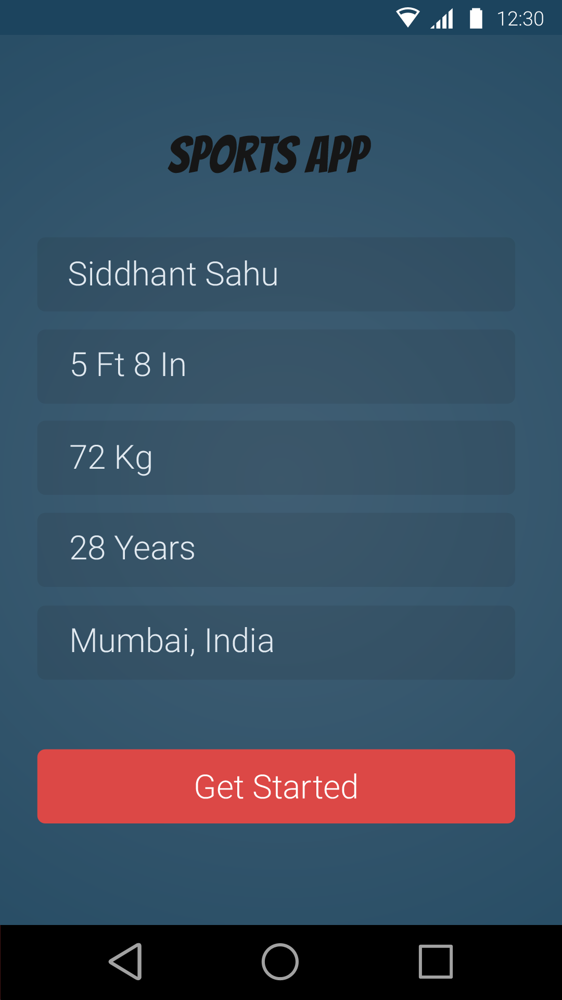

# AIS Sports Hackathon - Android App

Frontend code for sports hackathon (AIS), conducted at Zone Startups on 27-28th Feb, 2016.

_(Backend code is available [here](https://github.com/vivekpatel111/ais-sports-hackathon-svc))_

## Screenshot

> App Registration Activity

### Team
1. Vivek Patel (Android Developer)
2. Abhishek Kumar (Android Developer)
3. Siddhant Sahu (Backend Engineer)
4. Utkarsh Jain (Backend Engineer)
5. Himanshu Agarwal (Team Lead)
6. Kunal Maithani (UI/UX)
